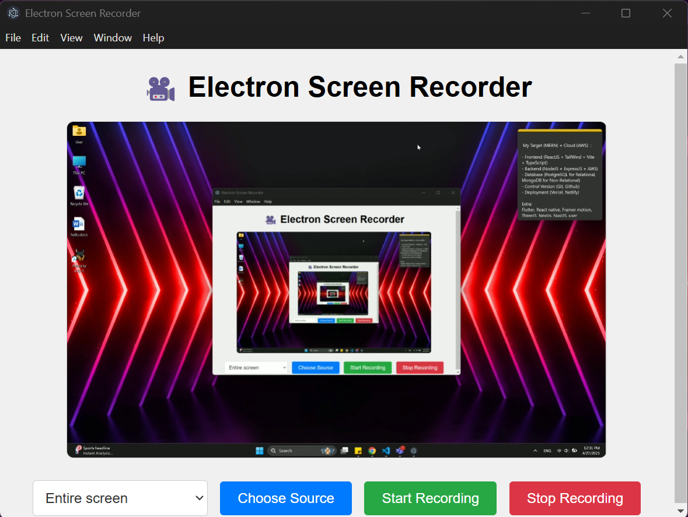

# 🎥 Screen Recording using ElectronJS

Welcome to **Screen-Recording-using-ElectronJS**!  
This project is a simple and lightweight desktop application built with **ElectronJS** that allows users to **record their screen** effortlessly. Whether you want to create tutorials, record meetings, or capture gaming sessions, this app has you covered.

---

## 🚀 Features

- 🎬 **Record entire screen or a specific window**
- 💾 **Save recordings in WebM or MP4 format**
- 🖥️ **Minimalistic and user-friendly interface**
- ⚡ **Fast and lightweight performance**
- 🛠️ **Built with ElectronJS and JavaScript**

---

## 📸 Demo

> *(You can add a GIF or screenshot here)*



---

## 🛠️ Installation

### Prerequisites
- Node.js (v14 or above)
- npm (comes with Node.js)

### Clone the repository
```bash
git clone https://github.com/your-username/Screen-Recording-using-ElectronJS.git
cd Screen-Recording-using-ElectronJS
```

### Install dependencies
```bash
npm install
```

### Run the app
```bash
npm start
```

---

## 🧩 Built With

- [ElectronJS](https://www.electronjs.org/)
- [HTML5 Screen Capture APIs](https://developer.mozilla.org/en-US/docs/Web/API/Screen_Capture_API)
- [JavaScript](https://developer.mozilla.org/en-US/docs/Web/JavaScript)

---

## 📂 Project Structure

```
Screen-Recording-using-ElectronJS/
│
├── main.js           # Electron main process
├── package.json      # Project metadata and dependencies
├── preload.js        # Preload script for secure context bridging
├── renderer.js       # Handles recording logic (frontend)
├── index.html        # User Interface
├── assets/           # Icons, images, and styles
└── README.md         # Project documentation
```

---

## ✨ Future Enhancements

- Add options for custom frame rate and resolution
- Allow selection of specific audio input/output devices
- Integrate recording pause and resume functionality
- Export in multiple formats (e.g., MOV, AVI)

---


